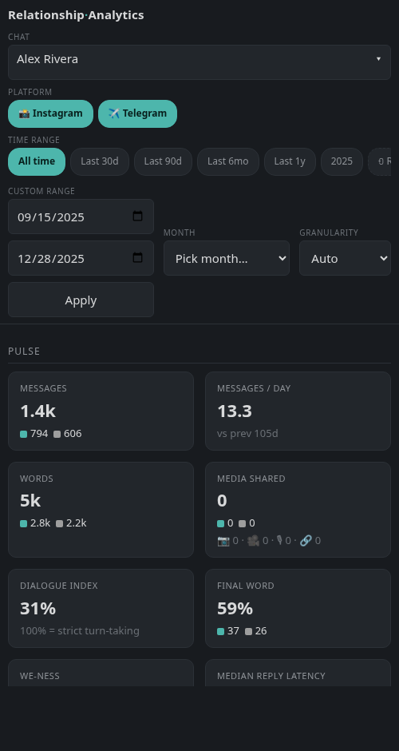
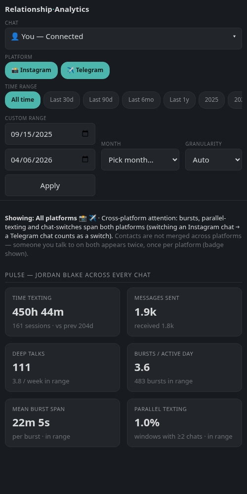

# Chat Analyzer (Instagram + Telegram)

Turn your own Instagram and Telegram chats into clear charts and an
interactive dashboard.

This tool looks at the messages in your conversations and shows you
things like who texts more, how fast each person replies, when you talk during
the day, how the tone changes over months, which words each person uses, and
much more.

**Everything runs on your own computer.** Your messages are never uploaded
anywhere. There is no account, no cloud, and no internet connection needed to
do the analysis. The results are plain files and a web page that live in a
folder on your machine.

---

## A look at what you get

_(All screenshots use a **synthetic** demo corpus — invented names and
messages, never anyone's real chats. Regenerate them any time with
`python scripts/screenshots.py`.)_


*Per-chat view — pulse metrics, story timeline and balance charts. The
Instagram / Telegram platform filter sits right next to the chat picker.*


*👤 You — Connected — a cross-chat portrait of you: texting span, attention
spread, session mix, and where your messages go across everyone.*

The same dashboard reflows for a phone browser — the chat picker becomes a
full-screen drawer, the KPI tiles stack two-per-row, the time-range chips
scroll sideways, and the charts resize to the screen:

<p>


</p>

*The per-chat and Connected views on a phone. Analysis still runs on your
computer — the phone is a viewer (see [On your phone](#on-your-phone)).*


---

## What you need

- A computer running Windows, macOS, or Linux.
- About 20 minutes (plus waiting time for Instagram to prepare your data).
- Your own Instagram and/or Telegram data download (steps below).

---

## Step 1 — Get your Instagram data

You have to ask Instagram for a copy of your messages. This is a normal,
built-in feature. Do it from the Instagram app or from instagram.com.

1. Open Instagram and go to **Settings**.
2. Tap **Accounts Center**.
3. Tap **Your information and permissions**.
4. Tap **Download your information**.
5. Tap **Download or transfer information**.
6. Choose the **account** you want to analyze.
7. Choose **Some of your information** (not everything).
8. In the list, tick **Messages** only. Leave everything else unticked.
9. Tap **Next** / **Download to device**.
10. Now set the options carefully:
    - **Format: JSON** — this is the most important setting. It must be JSON,
      *not* HTML. (If you pick HTML, the tool cannot read your data.)
    - **Media quality: Low** — keeps the download small; photos are not needed.
    - **Date range: All time** — so you get your full history.
11. Tap **Create files** / **Submit request**.
12. Now wait. Instagram prepares the file in the background. This can take
    anywhere from a few minutes to a couple of days. You will get an email
    and/or a notification when it is ready.
13. When it is ready, open the email or the Download your information page and
    **download the ZIP file** to your computer. Remember where you saved it
    (for example, your Downloads folder).

You now have a file with a name like `instagram-yourname-2026-...zip`.

### Telegram instead (or as well)?

Telegram exports come from the **desktop app** (Telegram Desktop on Windows,
macOS, or Linux — the phone app cannot export). For each conversation you want
to analyze:

1. Open **Telegram Desktop** and open the conversation.
2. Click the **⋮** (three dots) menu in the top-right → **Export chat history**.
3. Untick photos, videos, and files — only the messages are needed.
4. Set **Format** to **JSON** (click the "Format" line — it defaults to HTML,
   which the tool cannot read).
5. Set the date range to all time, then click **Export**.
6. You get a folder (usually called `ChatExport_<date>`) containing a
   `result.json` file. Zip that folder, or just remember where it is.

You can analyze Instagram only, Telegram only, or both together — the
dashboard shows all your chats side by side with a platform filter.

---

## Easiest way — download and run (no Python needed)

If you just want your results without touching a terminal, use the ready-made
app. It bundles everything, so there is nothing to install.

1. Go to the project's **Releases** page:
   **https://github.com/LeonardoDaviti/chat-analyzer/releases**
2. Download the file for your computer:
   - **Windows** → `ChatAnalyzer-windows.exe`
   - **Mac with Apple chip** (M1/M2/M3/M4) → `ChatAnalyzer-macos-arm64`
   - **Older Intel Mac** → `ChatAnalyzer-macos-intel`
   - **Linux** → build it yourself with the manual way below (a prebuilt Linux
     binary may not be attached to every release).
3. **Double-click it.** A small black window appears and your web browser opens
   by itself to a local page. (If the browser doesn't open, the black window
   prints an address like `http://127.0.0.1:8347/` — copy that into your
   browser.)
4. On that page, **drag your Instagram or Telegram ZIP onto the drop zone** (or
   click to pick the file, or paste the path to the file/folder). The tool
   imports it, analyzes every chat with a live progress bar, and when it's done
   the same page turns into your dashboard. To add more chats later, click the
   **➕ Add chats** button in the corner.

Everything still runs 100% on your own computer — the little web page is just
the app's screen; nothing is uploaded.

**Sharing a computer? Use profiles.** The setup page has a **Profile** section
(and a small switcher in the dashboard corner). Each profile keeps its own
chats, analysis and dashboard completely separate, so a friend can try the tool
on your laptop without mixing your data with theirs — click **New profile**, give
it a name, and their import lands in their own space. Switch back any time from
the same dropdown. Your existing data becomes the **`default`** profile
automatically the first time you update, so nothing moves or disappears.

**Where your results are saved:** the app stores your imported chats, the
`Outputs/` files and the `Dashboard/` in a **`ChatAnalyzer`** folder inside your
**Documents** folder (for example `Documents/ChatAnalyzer` — on Windows
`C:\Users\You\Documents\ChatAnalyzer`), so results never get scattered into
whatever folder you launched the app from. The exact location is printed in the
black window at startup and shown on the drop page. To store data somewhere
else, set the `CHAT_ANALYZER_HOME` environment variable to the folder you want.

### A one-time "are you sure?" warning (and why it's harmless)

These apps are **free and unsigned** — we don't pay Apple or Microsoft for a
code-signing certificate. So the first time you open one, your system shows a
scary-looking warning. This is expected. Here's how to get past it:

- **Windows — "Windows protected your PC" (SmartScreen):**
  1. Click the small **More info** link in that blue box.
  2. Click the **Run anyway** button that appears.

- **macOS — "cannot be opened because it is from an unidentified developer"
  (Gatekeeper):**
  1. In Finder, **right-click** (or Control-click) the downloaded file and
     choose **Open**.
  2. In the dialog, click **Open** again. You only have to do this once.
  - If that still won't open it, open the **Terminal** app and run
    `xattr -d com.apple.quarantine ` followed by a space and then drag the
    downloaded file onto the Terminal window, then press Enter. Now double-click
    the file normally.

If you would rather not run an unsigned binary at all, that's completely fair —
use the **manual way with Python** below instead. It does exactly the same thing
using the plain source code you can read.

---

## Step 2 — Set up the tool (the manual way, with Python)

This is the alternative to the download above — use it if you prefer running
the source code yourself, or you're on Linux. You only do this part once.

### 2a. Install Python

This tool needs **Python 3.11 or newer**.

- Download it from **https://www.python.org/downloads/** and run the installer.
- **On Windows:** on the first screen of the installer, tick the box that says
  **"Add Python to PATH"** before clicking Install. This matters.

To check it worked, open a terminal (see below) and type `python --version`
(on some systems `python3 --version`). You should see a version number of 3.11
or higher.

- **Windows terminal:** press the Start button, type **PowerShell**, open it.
- **macOS terminal:** open the **Terminal** app (in Applications → Utilities).
- **Linux terminal:** open your usual terminal app.

### 2b. Get the project

Download this project as a ZIP from its page (green **Code** button →
**Download ZIP**) and unzip it, or, if you know git:

```
git clone https://github.com/LeonardoDaviti/chat-analyzer.git
```

Then, in your terminal, go into the project folder. For example:

```
cd "Instagram Analysis"
```

### 2c. Create the environment and install

Copy and paste these commands into your terminal.

**Linux / macOS:**

```
python3 -m venv venv
source venv/bin/activate
python -m pip install -r requirements.txt
```

**Windows (PowerShell):**

```
python -m venv venv
venv\Scripts\Activate.ps1
python -m pip install -r requirements.txt
```

After this, your terminal prompt usually shows `(venv)` at the start. That
means the environment is active. If you close the terminal and come back later,
just run the `activate` line again before using the tool.

---

## Step 3 — Run the analysis

### 3a. Import your download

Point the tool at the ZIP file you got from Instagram or Telegram:

```
python main.py --import-zip path/to/your-download.zip
```

Replace `path/to/your-download.zip` with the real location of your file (for
example on Windows `C:\Users\You\Downloads\instagram-yourname-2026.zip`). The
tool recognizes which platform the ZIP came from on its own and files it into
`Chats/Instagram/` or `Chats/Telegram/` accordingly, then tells you how many
conversations it found. Run the command once per ZIP if you have several.

(You can also skip the ZIP and copy a Telegram `ChatExport_...` folder — the
one containing `result.json` — straight into `Chats/Telegram/` yourself. Both
ways work.)

### 3b. Analyze everything

```
python main.py
```

That's it. The tool finds all your chats, figures out **which name is yours**
automatically (it's the person who appears in every conversation), and analyzes
each chat. You'll see a line like:

```
Detected account owner: <owner-name> (use --my-name to override)
```

If it guesses your name wrong, you can set it yourself:

```
python main.py --my-name "Your Name"
```

Analyzing many chats can take a little while. When it finishes, results are
saved in a folder called `Outputs/`.

### 3c. Build the dashboard

```
python build_dashboard.py
```

Then open the file **`Dashboard/index.html`** by double-clicking it. It opens
in your normal web browser as a private local page.

### 3d. Build your personal profile (optional)

```
python build_connected.py
```

This adds a special **👤 You — Connected** entry at the top of the dashboard's
chat list. Instead of looking at one conversation, it merges *all* your
Instagram chats into a single portrait of you as a texter (see "What you get"
below). Re-run it whenever you re-run the analysis.

### Analyzing only some chats

You can focus on one or a few conversations by name:

```
python main.py --chat "<chat-name>"
python build_dashboard.py --chat "<chat-name>"
```

Or analyze everything but skip some chats:

```
python main.py --exclude "Group Chat,Spam Account"
```

---

## What you get

**In the `Outputs/` folder** — for each chat, a set of image charts (message
balance, busiest days, reply times, language mix, top words, and more), plus
the raw numbers as data files if you ever want them.

**In `Dashboard/index.html`** — one interactive page tying it all together. You
pick a chat (Instagram and Telegram chats live in the same list — use the
platform filter next to the chat picker to show only one platform), drag a
time slider, and every panel updates. It includes:

- **📋 Findings** — a short list of what actually stands out in a chat, in plain
  sentences: "one person carries the restarts", "the last few months run
  cooler than before", "you ask most of the questions". Each finding shows the
  numbers behind it and a "show me →" link to the chart it came from. If nothing
  clears the bar, it says so — silence beats a horoscope. (Connected has its own
  Findings about you across every chat.)
- **Pulse** — the headline numbers: total messages, who sends more, typical
  reply times, active days.
- **Timeline** — activity over time, with automatic markers where something
  clearly changed (a spike, a cooling-off, a shift in balance).
- **Balance & depth** — how evenly the conversation is shared, how long each
  person's "turns" run, and how deep versus casual the talk is.
- **Endings & restarts** — who tends to send the last message, who re-opens a
  quiet chat, and who gets "left on read" or "left on reacted".
- **Psycholinguistics** — gentle language signals like we/you/I balance, warm
  versus cold wording, and thank-yous and apologies.
- **Language cards** — each person's favourite words and emojis, most
  distinctive vocabulary, and how varied their language is.
- **Shifts** — a before-and-after comparison of two time periods so you can see
  what changed between them.
- **Telegram signals** (Telegram chats only) — extras that only Telegram data
  contains: how often each person edits their messages after sending, how much
  of the talk happens in explicit replies and how deep those reply chains go,
  who forwards content, and who sends the links, hashtags, and mentions.
- **👤 You — Connected** (after running `build_connected.py`) — your personal
  profile across *all* chats at once: how long you stay engaged when you start
  texting (your "texting span"), how often you juggle several conversations at
  the same time, what mix of quick pings versus deep talks your weeks contain,
  whom you answer fastest, who gets your late-night messages, how concentrated
  your attention is across people, and how many new people you met each month
  and kept talking to.

None of this is a judgement or a diagnosis — it's just a friendly, detailed
mirror of the patterns in your own conversations.

---

## On your phone

The dashboard is responsive — it works in a phone browser and can be **installed
as an app (PWA)** when you open it through the launcher. To be clear about what
this is and isn't: **the analysis always runs on your computer.** There is no
native app and nothing runs on the phone — your phone is just a **viewer** of the
dashboard your computer is serving on your home network. Nothing ever leaves your
machines.

**Open the dashboard on your phone (same Wi-Fi):**

1. On your computer, start the launcher. By default it prints a `127.0.0.1`
   address, which only works *on the computer itself*. To reach it from your
   phone, start it bound to your network instead:

   ```
   chat-analyzer --host 0.0.0.0
   ```
   (or `python launcher.py --host 0.0.0.0` from source). It will then also print
   an `http://<your-computer's-LAN-IP>:8347/` address.

   > **Security note:** `--host 0.0.0.0` exposes the dashboard to every device on
   > your network. Only do this on a network you trust (your home Wi-Fi), and stop
   > the launcher when you're done. Without this flag the server stays on
   > `127.0.0.1` and is not reachable from other devices.

2. On your phone's browser, go to that `http://<LAN-IP>:8347/` address. The
   dashboard loads in its mobile layout.

**Add it to your home screen (install the PWA):**

- **iPhone / Safari:** tap the **Share** button → **Add to Home Screen**.
- **Android / Chrome:** tap the **⋮** menu → **Install app** / **Add to Home
  Screen**.

Once installed it opens full-screen like an app and caches the interface for
quick loads, but it's still only showing the analysis your computer produced.
Re-run the analysis on the computer and refresh to see the new numbers.

*(Opening the dashboard's `index.html` directly as a file gets you the same
responsive layout, but the installable-app features only appear when it's served
by the launcher.)*

---

## Privacy

- The analysis runs **100% on your computer**. Nothing is sent over the
  internet.
- Your chats (`Chats/`), the results (`Outputs/`), and the dashboard
  (`Dashboard/`) are all kept out of version control on purpose, so they can't
  be accidentally shared or committed.
- The dashboard is a plain local file. Opening it does not upload anything; it
  simply reads the data already on your machine.

---

## Frequently asked questions

**I downloaded my data but the files end in `.html`, not `.json`.**
You got the wrong format. For Instagram, go back to Download your information
and request it again with **format: JSON**. For Telegram, export again from
Telegram Desktop and click the **Format** line to switch it from HTML to
**JSON**. The tool can only read JSON exports.

**My Instagram name and my Telegram name are different — is that a problem?**
No. The tool detects who you are separately for each platform, so "David" on
Instagram and "Davidus" on Telegram both get recognized as you automatically.

**The Georgian text or emojis look broken/garbled in the raw export.**
That's normal — Instagram stores them in a mangled way in the export file. The
tool automatically fixes (decodes) them, so the charts and dashboard show them
correctly. You don't need to do anything.

**How do I analyze just one conversation?**
Use the `--chat` option with part of the person's name, for example
`python main.py --chat "<chat-name>"` and then
`python build_dashboard.py --chat "<chat-name>"`.

**I added a new export into `Chats/` — how do I refresh?**
You have two easy ways:
- **In the app (easiest):** open the dashboard and click **↻ Re-analyze** in the
  bottom-right corner (next to **➕ Add chats**), or open the setup page and
  click **↻ Re-analyze everything**. It re-runs the whole analysis over
  everything currently in `Chats/` — no re-import needed — and rebuilds the
  dashboard, connected profile and findings.
- **From the command line:** re-run the pipeline and the builders:
  ```
  python main.py
  python build_dashboard.py
  python build_connected.py
  python build_insights.py
  ```
  (You only need `--import-zip` for a *brand-new* download; a folder you copied
  straight into `Chats/` is picked up automatically.)

**Can I import a Telegram folder without zipping it?**
Yes. Telegram exports arrive as a folder (the one with `result.json`). On the
setup page you can **drag the whole folder onto the drop zone**, click
**choose a folder** to pick it, or paste its path. (You can also drop a plain
`.zip`, or copy the folder into `Chats/Telegram/` yourself.)

**Someone else wants to try it on my computer — how do I keep our data apart?**
Use **profiles** (the better option): on the setup page, in the **Profile**
section, click **New profile**, name it, and their imports/analysis/dashboard
stay in their own space — switch between profiles any time from the dropdown
there or the switcher in the dashboard corner. Your original data is the
**`default`** profile. If you'd rather just wipe the *current* profile and start
over, click **Start fresh (archive current data)**: it moves that profile's
`Chats/`, `Outputs/` and `Dashboard/` into a timestamped
`profiles/<name>.backup-…` folder (nothing is deleted, and other profiles are
untouched) and returns you to an empty setup page. Rename the backup back if you
want that data again.

**Where do profiles live, and what happens to my old data?**
Each profile is a self-contained folder under `profiles/` inside your data
directory — `profiles/<name>/` with its own `Chats/`, `Outputs/` and
`Dashboard/`. The first time you run this version, any existing top-level
`Chats/`, `Outputs/` and `Dashboard/` are moved once into `profiles/default/`
automatically (a one-line note is printed); nothing is copied or deleted and the
step is skipped on every later run. Setting `CHAT_ANALYZER_HOME` still relocates
the whole data directory — profiles live inside it.

**Does the app phone home?**
The analysis never leaves your machine. The only network request the app ever
makes is a single, optional check against GitHub for a newer release, so it can
show a small "update available" banner. It has a short timeout and fails
silently — if you're offline, nothing happens and no banner appears.

**Where are my results?**
Charts and data are in `Outputs/`. The interactive page is
`Dashboard/index.html` — double-click it to open it in your browser.
